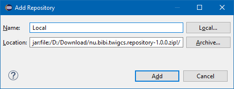

# Plugin-twigcs
[](https://travis-ci.org/laurentmuller/plugin-twigcs)

An Eclipse plugin to validate Twig (*.twig) files with the [Twigcs](https://github.com/friendsoftwig/twigcs) component.

Errors are visible in the **Editor**.


And displayed in the **Problems view**.


## Installation

- Install Twigcs component globally as explain in the [Twigcs Github site](https://github.com/friendsoftwig/twigcs). 

  ```bash
  composer global require friendsoftwig/twigcs
  ```

- Download the update site zip file from the releases tab.

- Start Eclipse PDT and select the menu **Help** -> **Install New Software...**

- Add the downloaded zip file as source.

  

- Select the newly added repository.  Check the the Twigcs category check box and follow the wizard instructions.

- An other solution is to download the the jar file from the releases tab and copy to the dropins folder of your Eclipse PDT installation.

- Update the [Workspace preferences](#workspace-preferences) to define the path to the Twigcs batch file.

- Update your [Project properties](#project-properties) to define witch folders are validate.

## Workspace preferences

The workspace preferences allow user to define how the Twigcs component run. The most important and required property is the path to the batch file.


## Project properties

For each project, user can select witch folders are included for the validation or are excluded. The user must select at least one included folder .


