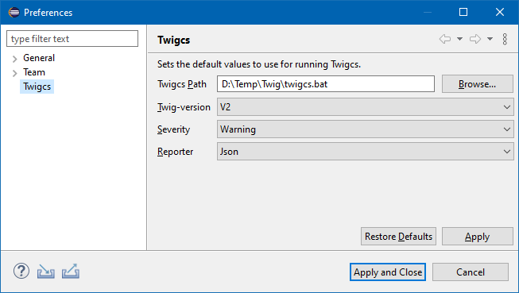

# Plugin-twigcs
An Eclipse plugin to validate Twig (*.twig) files with [Twigcs](https://github.com/friendsoftwig/twigcs) component.

## Installation
<TBD>

## Workspace preferences

<TBD>

## Project properties

<TBD>
