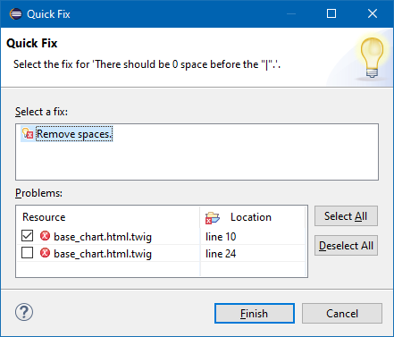
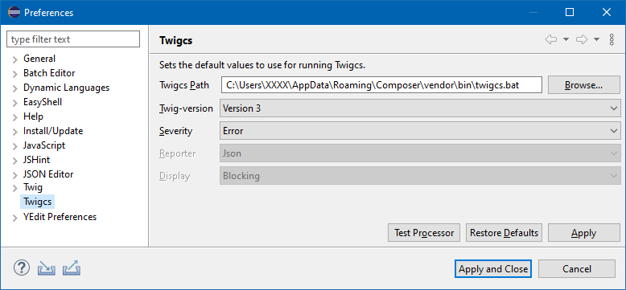

# Plugin-Twigcs

[](https://app.codacy.com/manual/laurentmuller/plugin-twigcs?utm_source=github.com&utm_medium=referral&utm_content=laurentmuller/plugin-twigcs&utm_campaign=Badge_Grade_Dashboard) [](https://travis-ci.org/laurentmuller/plugin-twigcs)

An Eclipse plugin to validate Twig (*.twig) files with the [Twigcs](https://github.com/friendsoftwig/twigcs) component.

Errors are visible in the **Editor**.


And displayed in the **Problems** view.


Some **Quick Fix** are also available.



## Installation

### Installation of Twigcs

- Install Twigcs component globally as explain in the [Twigcs Github site](https://github.com/friendsoftwig/twigcs).

    ```bash
    composer global require friendsoftwig/twigcs
    ```

### Installation from the Update Site

- Start Eclipse PDT and select the menu **Help** -> **Install New Software...**

- Click the **Add....** button.

- Enter the location as the image below.


- Select the newly added repository.

- Check the Twigcs category check box.


- Follow the wizard instructions. The Eclipse will be restarted.

- Update the [Workspace Preferences](#workspace-preferences) to define the path to the Twigcs batch file.

- Enable [Twigcs nature](#enable-twigcs-nature)  to the project.

- Update the [Project Properties](#project-properties) to define witch folders are validate.

### Installation from the Zip file

- Download the update site zip file from the releases tab.

- Start Eclipse PDT and select the menu **Help** -> **Install New Software...**

- Click the **Add....** button.

- Click the **Archive...** button and select the downloaded zip file.

    

- Select the newly added repository.

- Check the Twigcs category check box.

- Follow the wizard instructions.

## Workspace preferences

The workspace preferences allow user to define how the Twigcs component run. The most important and required property is the path to the batch file.



## Enable Twigcs Nature

To enable validation, You must add the Twigcs nature to the project.

- Select the project You want to update in the **Explorer View**.
- Display the context menu.
- Select **Configure** -> **Enable Twigcs validation**.


## Project properties

For each project, user can select witch folders are included for the validation or excluded. The user must select at least one included folder.

If needed, the user can also override the default Twigcs preferences.


