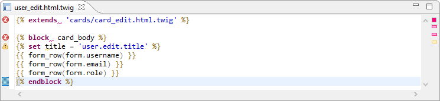

# Plugin-twigcs
An Eclipse plugin to validate Twig (*.twig) files with the [Twigcs](https://github.com/friendsoftwig/twigcs) component.

Errors are visible in the editor.



All errors are displayed in the **Problems view**.


[toc]

## Installation

- Install Twigcs component globally as explain in the [Github site](https://github.com/friendsoftwig/twigcs). 

  ```bash
  composer global require friendsoftwig/twigcs
  ```

- Copy the jar file to the dropins folder of your Eclipse PDT installation.

- Start Eclipse PDT.

- Update the [Workspace preferences]() to define the path to the batch file.

## Workspace preferences

The workspace preferences allow user to define how the Twigcs component run. The most important and required property is the path to the batch file.


## Project properties

For each project, user can select witch folders are included for the validation or are excluded.


